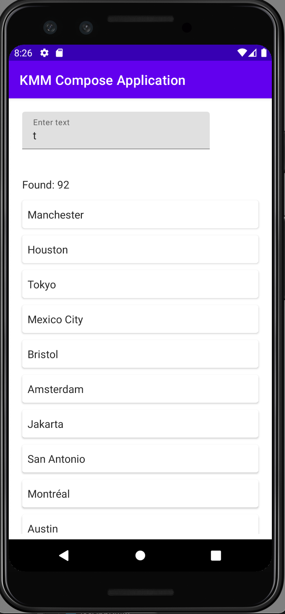

# KMM application with shared networking

## Description

Application uses generated with [OpenAPI generator](https://github.com/OpenAPITools/openapi-generator) [MetaWeather API](https://www.metaweather.com/api/) client for kotlin multiplatform mobile.

iOS application is written in SwiftUI.

Android application is written in Jetpack Compose.

Generated code is modified to work with iOS according to this bug report: [KTOR-1628](https://youtrack.jetbrains.com/issue/KTOR-1628#focus=Comments-27-4632247.0-0).

Application only displays list of cities according to a request.

## Screenshots

